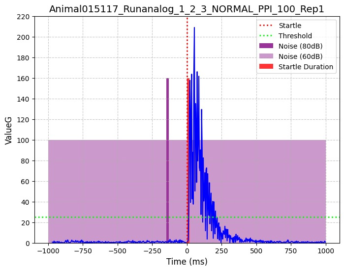
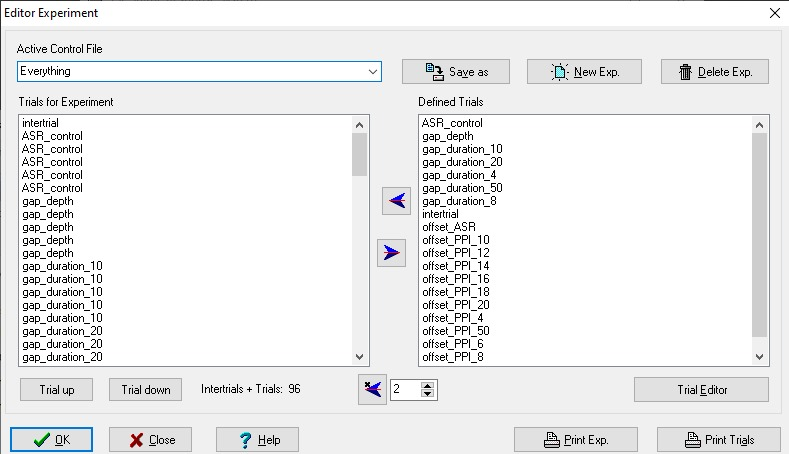
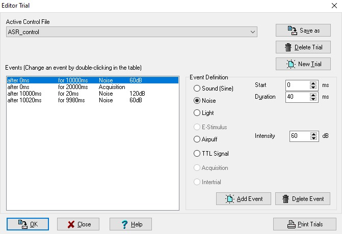
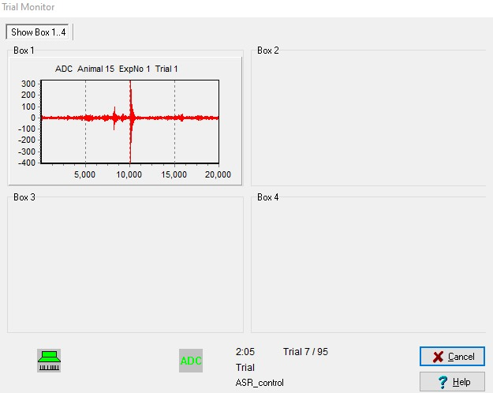
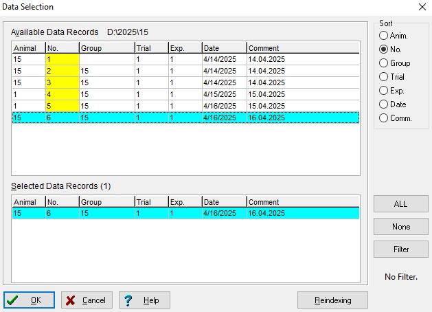

<!-- Settings -->

<!-- TODO 
- change example image to newer version
- missing image for Box 1 screen
- missing exact file path for trial and experiment data
-->

# Protocol on Startle Response Experiments
  
<h2 style="font-size: 28px;">Table of contents</h2>

<ul style="font-size: 18px;">
  <li><a href="#intro">Introduction</a></li>
  <li><a href="#exp_des">Experimental Design</a>
    <ul>
      <li><a href="#background">Background</a></li>
      <li><a href="#setup">Setup</a></li>
      <li><a href="#procedure">Procedure</a></li>
    </ul>
  </li>
  <li><a href="#software">Software</a>
    <ul>
      <li><a href="#recording">Recording</a></li>
      <li><a href="#analysis">Analysis</a></li>
    </ul>
  </li>
  <li><a href="#troubleshooting">Troubleshooting</a></li>
</ul>

  

## Introduction 

This is a guide for the startle response experiments. It will cover the setup and procedure of the experiment as well as the software used for recording and analysis. This repository also contains two notebooks for the analysis, `Peakfinder` and `Analyzer`, and some example outputs for reference. Due to file size limitations, any recording data needs to be added manually.

## Experimental Design 

### Background 

Acoustic startle response (ASR) experiments are a useful tool in examining the auditory processing of mammals under various conditions. Given a sudden, unexpected auditory stimulus, such as a loud noise within previous white background noise, muscles involuntarily contract, causing a measurable movement. A variety of conditions can influence this reflex, with pre-pulse inhibition (PPI) being used to test for changes in this response. If a lesser sound which is not strong enough to in itself facilitate a startle response is played before the actual startle, one can see a decrease in the response.   
 
*Fig. 1: Example visualization of a pre-pulse inhibition experiment. The experiment used here was an older one from a series of measurements in 2024.*  <!-- change to newer example -->

This "warning sound" can also be replaced with a gap in the otherwise constant background noise, and length and offset from the startle can be modulated. This allows for a very flexible experiment that does not require prior training of the animals, something that is for example crucial when testing for early hearing loss in mouse models with ataxia 13, where any experiment that would require training would be too time intensive to be viable while also being less reliable than an involuntary reflex. 

### Setup 

The setup consists of five parts: 
- A double-layered, sound-proof box with a pressure sensor 
- A cage holding the animal
- A box connecting the recording computer and the pressure sensor
- A computer with the recording software 
- A computer for running the analysis software (and a USB-stick for data transfer)

The sound-proof box consists of two layers, an inner one containing the pressure sensor and cage, secured by a rotating lock, and an outer one which can be fastened using two latches on the left side (be careful not to hit the emergency power switch next to the latches, you'd be the first!).  
The pressure sensor inside the chamber has pins inside it that hold the cage. Be careful not to press down onto the sensor, especially when putting down the cage, otherwise it could impact its calibration.  
Below the chamber, a box connects the sensor to the recording computer. It needs to be turned on before every recording day and off once you are done with measurments, with the switch being on the right side on the back of the device near the power cable.  
The connected computer has the "Startle Response" program installed and is used to record and store the data.  
Due to the age of this PC, it is recommended to use a different computer for the analysis. This can be any other computer or laptop, though the more capable and up to date, the faster the data transfer and analysis will be.

### Procedure 

To place the mouse into the cage for recording, take the cage out of the chamber, grabbing it by the tray, put it down into the box containing the mouse and open the lid. To get it into the cage, carefully but without too much hesitation, grab it around the upper third of its tail, lift it into the cage and close the lid. Be sure to neither grab the tail too far to the base, as this would allow the mouse to use enough muscles to turn around, or too far towards the tip, as that could make placing it into the cage more difficult. Now, put the cage with the animal back onto the sensor before closing both chamber doors and securing the outer one using the two latches. If you are having difficulty catching the mouse, try to wait a little and allow it to calm down. Also note that the red plastic "house" is not see-trough for the mouse, which can be used to your advantage when trying to grab it.  
Start a timer for ten minutes. This is the habituation period for the mouse and is crucial to ensure that it is not affected by anything that has happened before, especially if getting it into the cage was stressful.  
Make sure that the box is turned on, indicated by a green light on its front. Do the same for the recording computer and open the Startle Response software, logging in without a username or password. Assuming everything is set up correctly, you can now begin the recording. Further details on using the software will be covered later.  
Once the recording is done, open the chamber doors and remove the cage (this time being extra careful to get a good grip on the tray). Carefully move the mouse back into its container by placing the box inside and opening it, waiting for it to come out on its own. After you are done for the day, be sure to clean the tray of any excrements left behind.  
You can now copy the recorded data onto a USB-stick and to the device used for analysis.

## Software 

The software used consists of the TSE program for recording, a notebook for a preliminary cutting and analysis of the data and another for further evaluation such as significance tests and trend analysis.

### Recording 

The recoding software, although having a login screen, does not require a password. Once inside, there are several tabs to configure and conduct experiments.  
These are the Help, Experiment, Analysis, Archive, System Test, Parameters and Exit tabs.  
 - Help: link to guides
 - Experiment: configure trials and experiments and start measurements
 - Analysis: select and export data
 - Archive: configure location of saved data
 - System Test: check system functions
 - Parameters: configure export parameters
 - Exit: exit the software

 The most commonly used tabs are Experiment, Analysis and Archive.

#### Experiment Tab
Here you can configure and run experiments. Under `Experiment`, you can find the setup for loading and executing an experiment file containing the trials, both of which can be configured in the `Editor`. To begin an experiment, select the right experiment file, whether or not and in what way you want the trials to be randomized, applying the randomization if applicable. Now, tick `Box 1` and input any relevant information. Note that the field `Animal No.` cannot start with a 0 like some animal numbers do, so it is recommended to use the `Group` or other fields if you wish to save the animal's full number. 
<!-- missing image: Box 1 screen -->

The `Editor` allows you to configure the trials and the experiments they make up.  

*Fig. 2: Experiment (top) and Trial Editor (bottom). Trials can be created and edited in the trial editor to then be moved into experiments. One experiment can hold multiple instances of the same trial. The trial shown goes on for 20 seconds, playing a 60dB background noise for the first 10 seconds, then playing the 120dB startle noise for 20ms before switching back to the background noise for the remainder of the 20 seconds.*

An experiment always contains one "intertrial" at the beginning, a short, empty trial needed for the software, and five instances of each trial, though the latter can vary. A trial, accessible via the `Trial Editor`, is usually 20 seconds long and begins with the command to begin recording immediately for the duration of the trial, so 20000ms of `Acquisition` starting at 0ms. The background noise is also started from the beginning and usually goes on for around 10 seconds before trial specific events happen, though this time too can vary. Note that for software reasons, the noise has to be before the acquisition, even though both start at the same time. 

Under `Experiment`, you can now start the recording. Select the experiment you want to run and whether or not to shuffle the trials, then tick `Box 1`, configure the animal and trial parameters accordingly and run the experiment.  
  
*Fig. 3: Pop-up during recording. The image in Box 1 (top) shows the current measurement, the green icons (bottom left) indicate that both recording and stimulation are working. Information on the progress of trials is also provided (bottom right).*
  
 If everything is working, you should now see a live visualization of the reactions as well as indicators for the noise and recording. If you are running a lot of trials at once, it may be advisable to roughly calculate how much time everything will take (usually 20 seconds per trial) and set a timer accordingly. Besides ensuring that both the sound and recording is running, you do not necessarily need to be present for the duration of the experiment. For example, with 19 different trials with 5 repetitions at 20 seconds each, this would take a little over half an hour per animal, or roughly 45 minutes including the 10 minute habituation period and the time needed to transfer the animal, making a recording day for six animal at least 4.5 hours long. Knowing this can be useful in order to plan out recoding days ahead of time.
 

#### Analysis Tab
The analysis tab is where you select and export your data. `Data Selection` shows all recorded data in the top field, by default sorted in the order it was recorded in. Either double-clicking on one of the lines or using the `ALL` or `Filter` options copies one or more recordings into the bottom field. When exporting data, only these recordings will be exported.   
  
*Fig. 4: Data Selection screen. Recording number 6 has been selected and is now ready to be exported.*
  
`Export Analog Data` exports the files in the way specified in `Parameters -> Export Parameters`. By default, this should be the CSV files we need for the analysis. Should you also wish to save Excel files, you can change the export parameters accordingly. Although more pleasant to look at, these are substantially slower to process and are thus not suitable for analysis.

#### Archive Tab
`Data Directory` defines the directory all recording data is saved to, while the `Reindexing` option allows you to update the `Data Selection` whenever you change directory. The `Data Selection` window also has this option.  
Recorded data is saved onto the `Data (D:)` drive. Make sure to make a folder for your recordings and set it as the new data directory before starting your line of experiments in order to not mix the results with old recordings.  
Should you ever wish to back up your experiments and trials, they can be found in the TSE folder on the `System (C:)` drive.
<!-- add exact file path -->

### Analysis 

In order to familiarize yourself with the analysis software, it would be best to go through both notebooks once to know what outputs to expect.  
To now use your own data, create a new folder, for example named after the current year or operator, inside the same directory as the notebooks. Now, place all of your CSV files inside this folder. The names of the folder and files are not important for anything other than your own organitation.  
There are two different notebooks used for analysis, the first one, `Peakfinder`, taking the raw data and turning it into excel files containing the reaction time, the time until the peak, the difference between the former two and the strength of the peak, all averaged across the different experiments. The second notebook, `Analyzer`, takes these files and runs several tests on them, examining changes across animals and experiments. Especially the latter can and should be edited by you to fit your specific needs.  
First, in the `Peakfinder` notebook, change the variable `input_dir` of the second codeblock to the name you gave to the new folder.  
Additionally, there are two dictionaries you may need to adjust. The `startle_time` dictionary links the trials to the times in which the startle is played within them. You will need to insert your own, should they not already be included. If there be multiple startles in one trial, insert them as a list.  
The second dictionary is `sex`, wherein you need to link the animals by number to their sex. Note that the animal numbers are shortened to their final digits, so there may be overlap with older entries when you enter your own.  
Other settings you may want to change are `output_dir`, which defines where you want the output files to go, and `verbose`, which when set to `False`, mutes all output except for error messages.  
Further details on the code are included in the notebooks' Markdown sections and comments.  
  
The `Analyzer` notebook is currently incomplete and will be updated at a later time. Both notebooks may be subject to change, but older versions can always be accessed via GitHub.

## Troubleshooting 
 

### Oh God it escaped!
Don't panic. The mouse may be more agile than you, but (hopefully) it is not smarter. Stay calm and attempt to scoop it up again as done before. It will likely move towards something it perceives as cover - a pile of cables, a dark corner, a bag or jacket, etc. Carefully check all of these spots until you find it, and avoid loud noises or rash movements to not scare it further.

### Recording Software Error
Restart the software, box and PC, check the cables, threaten the PC with fire or hammers and if all else fails, call customer support.

### Analysis Software Error
Usually, any error the notebooks put out is well documented. Check if the files look ok (expected file size, normal column organization, no corruption etc.), whether or not the startle times are set correctly and if in applicable, look up the error code. If the debugging code block at the end of the notebook says that it encountered a lot of bad peaks, examine the respective recordings. If the peaks really are too early, late or non-existent, proceed as is fit for your use case, adjusting whether or not to discard them in the configuration block at the beginning of the notebook. Having some recordings with an insignificant or missing reaction to the startle sound is perfectly normal, though. If you suspect that something is wrong with the code or need help understanding a part of it, feel free to reach out to me directly or via another group member. If you happen to have a fix for it and know your way around GitHub, you could even submit a pull request.